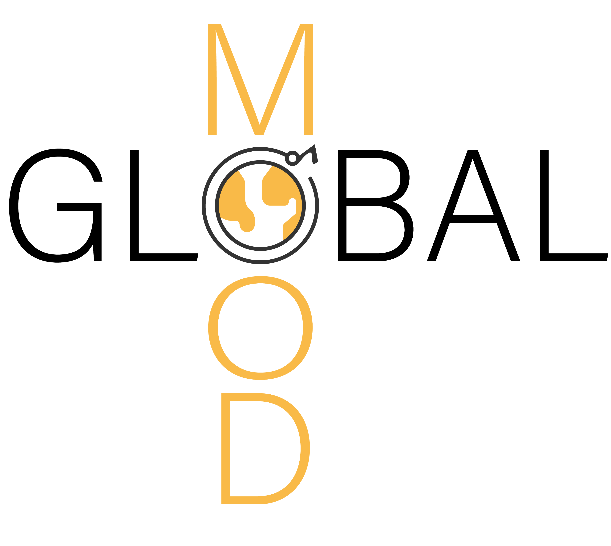

# GlobalMood: A Cross-Cultural Benchmark for Music Emotion Recognition

[](https://opensource.org/licenses/MIT)

This repository contains the data, code, and experimental materials for **"GlobalMood: A cross-cultural benchmark for music emotion recognition"** to be presented at ISMIR (International Society for Music Information Retrieval).

## Overview

<table style="border: none;">
<tr>
<td width="40%" style="border: none;">

</td>
<td width="60%" style="border: none;">
GlobalMood is a large-scale cross-cultural dataset for music emotion recognition (MER), featuring:

- **1,182 music tracks** from **5 countries** (in future, it will expand to over 20 countries)
- **Multilingual participant ratings** in 5 languages (Arabic, Spanish, French, Korean, English)
- **Mood descriptors** are freely elicitated through iterative chain process across participants
</td>
</tr>
</table>

## Dataset Description

The `Data/` directory contains four main CSV files:

- **`songmeta_GlobalMood.csv`** (70KB): Song metadata including YouTube video IDs, countries, artists, and titles
- **`rawrating_GlobalMood.csv`** (30MB): Individual participant ratings for each song-mood pair
- **`meanrating_GlobalMood.csv`** (6.3MB): Aggregated mean ratings across participants in each country
- **`chains_GlobalMood.csv`** (5.9MB): Tag provided by participants in chains during the elicitation phase

## Experimental Design

The experiment was implemented using the [PsyNet framework](https://www.psynet.dev/). For more information about PsyNet, see the [documentation website](https://psynetdev.gitlab.io/PsyNet/).

Participants rated how well each moood tag represents the **mood expressed or conveyed** by the music using a 5-point scale:

- **1** - Not expressing at all
- **2** - Slightly expressing  
- **3** - Moderately expressing
- **4** - Very expressing
- **5** - Extremely expressing


## Citation

If you use this dataset in your research, please cite:

```bibtex
@inproceedings{lee-globalmood2024,
  title={GlobalMood: A cross-cultural benchmark for music emotion recognition},
  author={"Lee, Harin and {\c C}elen, Elif and Harrison, Peter and Anglada-Tort, Manuel and van Rijn, Pol and Park, Minsu and Sch{\"o}nwiesner, Marc and Jacoby, Nori"},
  booktitle={Proceedings of the 26th International Society for Music Information Retrieval Conference (ISMIR)},
  year={2025}
}
```

## License

This project is licensed under the MIT License - see the [LICENSE](LICENSE) file for details.

## Contact

For questions about the dataset or experiment, please contact [Harin Lee](harinleeresearch@gmail.com).